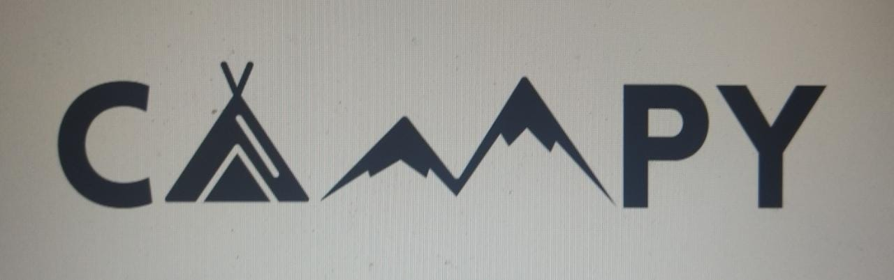

<a name="readme-top"></a>


[![Contributors][contributors-shield]][contributors-url]
<!-- [![Forks][forks-shield]][forks-url] -->
<!-- [![Stargazers][stars-shield]][stars-url] -->
<!-- [![Issues][issues-shield]][issues-url] -->
<!-- [![MIT License][license-shield]][license-url] -->


<!-- PROJECT LOGO -->
<br />
<div align="center">
   
  

  <h3 align="center"></h3>

  <p align="center">
    Forum and booking related to the camping world
    <br />
    <a href="https://Linkdeldeploy.com"><strong>go to the page</strong></a>
    <br />
       <a href="https://maildecontacto"> <strong>Report Bug </strong></a>
    
  </p>
</div>


<!-- ABOUT THE PROJECT -->
## About The Project


Booking project entirely dedicated to camping.
Generates visibility to regional tourism, increasing the local economy
It also provides an easily accessible platform, an intuitive interface that provides a quick response when making a reservation.

This same interface has several filtering and ordering systems, this makes it even easier for the user to search, who can leave their score and review.
It also has an internal forum, in which you can count the experiences lived, whether they are positive or negative.


### Built With

This section should list any major frameworks/libraries used to bootstrap your project. Leave any add-ons/plugins for the acknowledgements section. Here are a few examples.

* [![Typescript][Typescript]][Typescript-url]
* [![React][React]][React-url]
* [![Redux][Redux]][Redux-url]
* [![MaterialUI][MaterialUI]][MaterialUI-url]
* [![Common][Common]][Common-url]
<!-- * [![Laravel][Laravel.com]][Laravel-url]
* [![Bootstrap][Bootstrap.com]][Bootstrap-url]
* [![JQuery][JQuery.com]][JQuery-url] -->


<!-- GETTING STARTED -->
## Getting Started

This is an example of how you may give instructions on setting up your project locally.
To get a local copy up and running follow these simple example steps.


### Installation

_Below is an example of how you can instruct your audience on installing and setting up your app. This template doesn't rely on any external dependencies or services._


1. Clone the repo
   ```sh
   git clone https://github.com/ACRUNO/Campy-frontend.git
   ```
3. Install NPM packages
   ```sh
   npm install
   ```
4. Start the app
  ```sh
   npm Start
   ```


<!-- USAGE EXAMPLES -->
## Preview-images 

Here are some images of the page in operation and its features.
<div align="center">
   
    
   </div>

<!-- CONTRIBUTING -->
## Contributing

You can only collaborate with prior invitation.
If you are part of the developer team, these are the steps to follow for a correct management of GitFlow **GitFlow**.

1. Clone the proyect
2. Create your Feature Branch (`git checkout -b YourName`)
3. Commit your Changes (`git commit -m 'Add some AmazingFeature'`)
4. Push to the Branch (`git push origin YourName`)
5. Open a Pull Request
6. Wait.


<!-- CONTRIBUTING -->
## Contributors 

 **Contact us**
<div>   

  [![Javier][Javier-shield]][Javier-url]

 [![Augusto][Augusto-shield]][Augusto-url]

 [![Joaquin][Joaquin-shield]][Joaquin-url]

 [![Virginia][Virginia-shield]][Virginia-url]

 [![Gabriela][Gabriela-shield]][Gabriela-url]

 [![Santiago][Santiago-shield]][Santiago-url]

 [![Agustin][Agustin-shield]][Agustin-url]

</div>


<!-- MARKDOWN LINKS & IMAGES -->
<!-- https://www.markdownguide.org/basic-syntax/#reference-style-links -->
[contributors-shield]: https://img.shields.io/github/contributors/ACRUNO/Campy-frontend.svg?style=for-the-badge
[contributors-url]: https://github.com/ACRUNO/Campy-frontend/graphs/contributors
[forks-shield]: https://img.shields.io/github/forks/othneildrew/Best-README-Template.svg?style=for-the-badge
[forks-url]: https://github.com/othneildrew/Best-README-Template/network/members
[stars-shield]: https://img.shields.io/github/stars/othneildrew/Best-README-Template.svg?style=for-the-badge
[stars-url]: https://github.com/othneildrew/Best-README-Template/stargazers
[issues-shield]: https://img.shields.io/github/issues/othneildrew/Best-README-Template.svg?style=for-the-badge
[issues-url]: https://github.com/othneildrew/Best-README-Template/issues
[license-shield]: https://img.shields.io/github/license/othneildrew/Best-README-Template.svg?style=for-the-badge
[license-url]: https://github.com/othneildrew/Best-README-Template/blob/master/LICENSE.txt

[product-screenshot]: images/screenshot.png
[Typescript]:https://img.shields.io/badge/Typescript-35495E?style=for-the-badge&logo=Typescript&logoColor=4FC08D
[Typescript-url]:https://www.typescriptlang.org/
[React]: https://img.shields.io/badge/React-20232A?style=for-the-badge&logo=react&logoColor=61DAFB
[React-url]: https://reactjs.org/
[Redux]: https://img.shields.io/badge/Redux-35495E?style=for-the-badge&logo=Redux&logoColor=4FC08D
[Redux-url]: https://redux.js.org/
[MaterialUI]: https://img.shields.io/badge/Material-Ui-35495E?style=for-the-badge&logo=MaterialUi&logoColor=4FC08D
[MaterialUI-url]: https://mui.com/
[Common]: https://img.shields.io/badge/Common.js-35495E?style=for-the-badge&logo=commondotjs&logoColor=4FC08D
[Common-url]: https://
[Laravel.com]: https://img.shields.io/badge/Laravel-FF2D20?style=for-the-badge&logo=laravel&logoColor=white
[Laravel-url]: https://laravel.com
[Bootstrap.com]: https://img.shields.io/badge/Bootstrap-563D7C?style=for-the-badge&logo=bootstrap&logoColor=white
[Bootstrap-url]: https://getbootstrap.com
[JQuery.com]: https://img.shields.io/badge/jQuery-0769AD?style=for-the-badge&logo=jquery&logoColor=white
[JQuery-url]: https://jquery.com 


[Javier-url]: https://www.linkedin.com/in/javier-leandro-montenegro/
[Javier-shield]: https://img.shields.io/badge/Javier-black.svg?style=for-the-badge&logo=linkedin&colorB=555
[Augusto-url]: https://www.linkedin.com/in/augusto-gabriel-alvarez-360895240/
[Augusto-shield]: https://img.shields.io/badge/Augusto-black.svg?style=for-the-badge&logo=linkedin&colorB=555
[Joaquin-url]: https://www.linkedin.com/in/joaquin-delgado-2702391b0/
[Joaquin-shield]: https://img.shields.io/badge/Joaquin-black.svg?style=for-the-badge&logo=linkedin&colorB=555
[Virginia-url]: https://www.linkedin.com/in/
[Virginia-shield]: https://img.shields.io/badge/Virginia-black.svg?style=for-the-badge&logo=linkedin&colorB=555
[Gabriela-url]: https://www.linkedin.com/in
[Gabriela-shield]: https://img.shields.io/badge/Gabriela-black.svg?style=for-the-badge&logo=linkedin&colorB=555
[Santiago-url]: https://www.linkedin.com/in/
[Santiago-shield]: https://img.shields.io/badge/Santiago-black.svg?style=for-the-badge&logo=linkedin&colorB=555
[Agustin-url]: https://www.linkedin.com/in/
[Agustin-shield]: https://img.shields.io/badge/Agustin-black.svg?style=for-the-badge&logo=linkedin&colorB=555